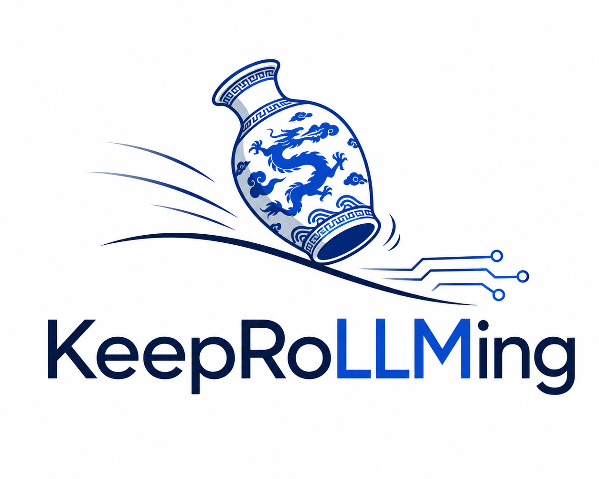

<p align="center">
  
</p>

<p align="center">
  <strong><em>Keep your LLM rolling.</em></strong><br>
  Reliable long-running AI chats and agents on local or remote LLM backends.
</p>

<p align="center">
  <a href="https://www.gnu.org/licenses/agpl-3.0"></a>
  
</p>

# KeepRoLLMing

KeepRoLLMing is an OpenAI-compatible proxy that makes local and remote LLM
backends more reliable. It gives clients stable route names while adding
context management, streaming recovery, tool/reasoning loop protection,
request filters, and observability.

> **Alpha software.** Configuration and extension APIs may evolve before 1.0.
> Requests and responses can be logged locally. Review `observability` settings
> before using sensitive traffic or exposing the service to untrusted networks.

## The problem

LLMs fail in recurring, recognizable ways—especially in long-running chats and
agent loops. KeepRoLLMing addresses those failure modes between an
OpenAI-compatible client and its upstream backend.

| Failure mode | Typical symptom | KeepRoLLMing capability |
|---|---|---|
| Incomplete response | The model ends after “Let me check:” | `model_nudge` can request continuation |
| Repeated tool call | The same call is made again with the same arguments | `model_tool_loop_stopper` can interrupt the loop |
| Repeated reasoning | The model reproduces the same reasoning block | `reasoning_loop_stopper` can interrupt the loop |
| Context pressure | A long conversation approaches the model window | `summarization` can repack prior context |
| Non-standard tool output | An upstream model emits supported XML pseudo-calls | `tool_rewrite` converts them to OpenAI tool calls |
| Slow streaming | A client needs an OpenAI-compatible, observable stream | The canonical streaming pipeline preserves SSE ordering and terminal framing |

## The solution

KeepRoLLMing sits between your client and any OpenAI-compatible backend. Your
client continues to call `/v1/chat/completions`; routes select the backend and
enable only the modules appropriate for that route.

```text
OpenAI-compatible client → KeepRoLLMing route → filters → upstream LLM
                         ← canonical streaming pipeline ← finalizers
```

The practical result is longer-running conversations and agents with less
manual recovery: a client can keep a stable model name while you change an
upstream, tune inference parameters, add a system prompt, or enable protection
against a specific failure mode in configuration.

## What you get

- **Backend abstraction:** stable client-facing routes for llama.cpp, vLLM, LM
  Studio, remote OpenAI-compatible APIs, and similar servers.
- **Composable reliability modules:** request, response, and streaming modules
  for context handling, recovery, tool calls, and reasoning.
- **OpenAI-compatible streaming:** canonical events preserve the ordering of
  reasoning, tool calls, terminal `finish_reason`, and `[DONE]`.
- **Local observability:** configurable PLAIN/JSON projections, performance
  metrics, and opt-in raw SSE capture for focused debugging.
- **Per-route configuration:** inheritance keeps shared backend settings in
  one place while each public route stays explicit.

## Quick start

Requires Python 3.11 or newer.

```bash
git clone https://github.com/danielebruneo/KeepRoLLMing.git
cd KeepRoLLMing
bash scripts/setup.sh
bash scripts/start-with-fake.sh
```

In another terminal, while the fake server is running:

```bash
curl -s http://127.0.0.1:8000/v1/chat/completions \
  -H 'content-type: application/json' \
  -d '{"model":"internal/fake","messages":[{"role":"user","content":"Hello"}],"stream":false}'
```

The fake backend is a deterministic smoke test. Stop it with `Ctrl-C` in the
terminal that runs `start-with-fake.sh`.

## Connect an LLM backend

```bash
cp config.example.yaml config.yaml
# Edit config.yaml: set base/local.model and base/local.upstream_url.
./krm serve --port 8000 --config config.yaml
```

Send requests using the configured route name, for example `chat/local` or
`code/assistant`. Routes can point to llama.cpp, vLLM, LM Studio, or another
OpenAI-compatible API. See [Configuration](docs/CONFIGURATION.md).

For a local background process with logs in a writable project directory:

```bash
./krm start --port 8000 --config config.yaml
./krm status --port 8000
```

## Routes in practice

Routes are a small configuration layer between clients and backends. A private
base route holds shared connection settings; public routes inherit it and give
clients meaningful, stable model names.

```yaml
routes:
  base/local:
    is_private: true
    model: "qwen-local"
    upstream_url: "http://127.0.0.1:8080"

  chat/default:
    extends: base/local
    pattern: "chat/default"

  chat/creative:
    extends: base/local
    pattern: "chat/creative"
    overrides:
      temperature: 0.8
      top_p: 0.95
      max_tokens: 2048
      reasoning_effort: high
```

Clients use `chat/default` or `chat/creative`; the configured `overrides` are
applied to the request sent upstream. You can move either route to another
backend later without changing client configuration.

`reasoning_effort` is forwarded as the OpenAI-compatible top-level request
field used by LibreChat's reasoning control. Its supported values are defined
by the selected upstream model/runtime; for example, a Qwen-compatible backend
may accept `low`, `medium`, or `high`.

Routes can also fail over to another route after an upstream failure:

```yaml
routes:
  base/remote:
    is_private: true
    model: "remote-chat-model"
    upstream_url: "https://api.example.com"
    api_key: "replace-me"

  chat/remote:
    extends: base/remote
    pattern: "chat/remote"

  chat/resilient:
    extends: base/local
    pattern: "chat/resilient"
    fallback_chain: ["chat/remote"]
```

Here a request to `chat/resilient` uses the local backend first, then tries
`chat/remote` only if the upstream attempt fails. Inheritance also composes
filter settings, so route-specific behaviour remains explicit rather than
being embedded in each client. See the complete, validated
[`config.example.full.yaml`](config.example.full.yaml) for all route fields and
built-in filters.

## How it works

```text
OpenAI client → route resolution → request filters → upstream backend
              ← canonical streaming pipeline ← stream finalizers
```

Routes are declared in `config.yaml`. Each route may inherit settings from a
base route and enables filter modules under a direct `filters:` mapping. YAML
mapping order is not significant: each module declares its own priority, which
can be explicitly overridden per route when required.

Built-in modules include:

- `system_prompt` — inject or replace a system prompt.
- `summarization` — repack a conversation when context pressure requires it.
- `multimodal_validator` — repair image marker/payload mismatches.
- `tool_rewrite` — convert supported XML pseudo-tool calls to OpenAI calls.
- `model_nudge` — continue a response that ends in a configured lazy pattern.
- `model_tool_loop_stopper` and `reasoning_loop_stopper` — interrupt repeated behaviour.
- `timestamp` — inject request time and append a response timestamp.

## Configuration examples

- [`config.example.yaml`](config.example.yaml): minimal configuration to copy
  and edit.
- [`config.example.full.yaml`](config.example.full.yaml): validated reference
  for all public settings and built-in filter options.

Do not copy placeholder API keys or URLs from the full example.

## Documentation

| Guide | Purpose |
|---|---|
| [Getting started](docs/GETTING_STARTED.md) | Install, run the fake backend, connect an upstream |
| [Configuration](docs/CONFIGURATION.md) | Root settings, routes, inheritance, observability |
| [Filter pipeline](docs/FILTER_PIPELINE.md) | Module lifecycle and streaming behaviour |
| [Deployment](docs/DEPLOYMENT.md) | Daemon, container, reverse proxy |
| [Troubleshooting](docs/TROUBLESHOOTING.md) | Startup, routing, logging, streaming diagnosis |
| [Contributing](CONTRIBUTING.md) | Development setup and verification loop |

## Contributing

```bash
bash scripts/setup.sh --dev
bash scripts/run-single-test.sh tests/filters/test_registry.py
bash scripts/run-parallel-tests.sh
ruff check keeprollming tests/filters/test_registry.py
```

See [CONTRIBUTING.md](CONTRIBUTING.md) for the public contribution workflow.

## License

AGPL-3.0-only. See [LICENSE](LICENSE).
